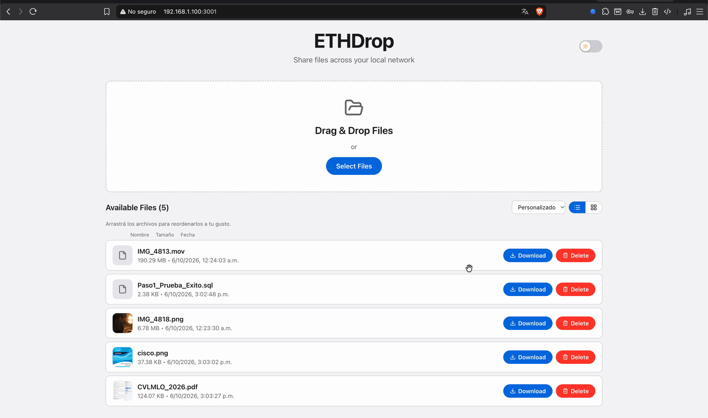
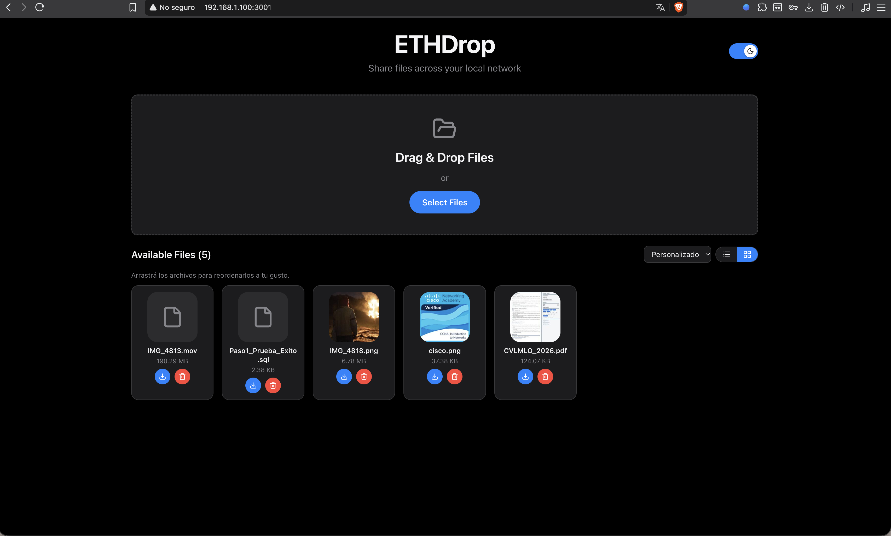
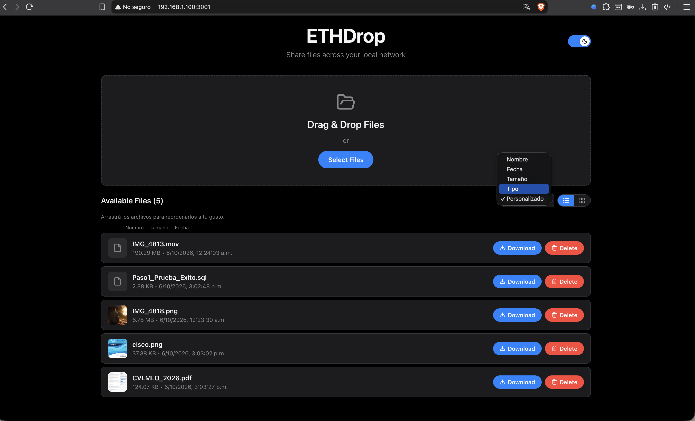

# ETHDrop

[](LICENSE)


Una aplicación web para transferir archivos entre dispositivos en la misma red local (LAN/Wi-Fi), similar a AirDrop o Google Drive local.

<p align="center">
  
</p>

<p align="center">
  🎬 <a href="docs/media/demo.mov">Ver el video completo en alta calidad (.mov)</a>
</p>

<table>
  <tr>
    <td align="center"><strong>Vista en grilla</strong></td>
    <td align="center"><strong>Vista en lista + ordenamiento</strong></td>
  </tr>
  <tr>
    <td></td>
    <td></td>
  </tr>
</table>

## Características

- Drag & drop para subir archivos
- Selección de archivos mediante botón
- Lista de archivos disponibles con nombre, tamaño y fecha
- Preview con miniatura para imágenes (y PDFs, si está instalado `poppler-utils`)
- Vistas de lista y grilla, ordenamiento por nombre/fecha/tamaño/tipo, y orden manual arrastrable compartido entre dispositivos
- Tema claro/oscuro con transición animada, tipografía de sistema de Apple e íconos de [Lucide](https://lucide.dev/)
- Descarga de archivos
- Eliminación de archivos
- Barra de progreso de subida
- Manejo de archivos grandes con streams (sin cargar en memoria)
- Acceso desde cualquier dispositivo en la red local
- Seguridad básica (prevención de path traversal, sanitización de nombres)
- Servidor único en producción: el backend sirve el frontend ya compilado (un solo puerto, sin pasos manuales)
- Arranque automático y auto-reinicio vía servicio systemd (ver [`deploy/`](deploy/))

## Requisitos

- **Node.js** v18 o superior
- **npm** v9 o superior
- Conexión a la misma red LAN/Wi-Fi entre dispositivos

## Instalación

1. Clona o descarga este repositorio
2. Instala las dependencias:

```bash
# Desde la raíz del proyecto (instala root + backend + frontend)
npm run install:all

# O instala cada parte por separado
npm install
cd backend && npm install
cd ../frontend && npm install
```

## Ejecución

### Modo Producción / Servidor único (Recomendado)

El backend sirve el build del frontend, así que **con un solo proceso corriendo ya tienes ETHDrop accesible** — no hace falta levantar dos servidores.

Desde la raíz del proyecto:

```bash
npm run build   # Compila backend (TS -> JS) y genera el build de producción del frontend
npm start       # Levanta el backend en http://0.0.0.0:3001, sirviendo también el frontend
```

En cuanto el proceso arranca, abre tu navegador en `http://localhost:3001` (o la IP de la máquina, ver abajo) y la app ya está lista para usarse, sin pasos adicionales.

### Modo Desarrollo (hot-reload en frontend y backend)

Útil mientras editas el código. Desde la raíz del proyecto:

```bash
npm run dev
```

Este comando ejecuta simultáneamente:
- Backend en `http://0.0.0.0:3001` (con recarga automática vía `tsx watch`)
- Frontend en `http://0.0.0.0:5173` (con recarga automática vía Vite, con proxy de `/api` hacia el backend)

En desarrollo, usa `http://localhost:5173` para tener hot-reload del frontend.

Si prefieres ejecutarlos en terminales separadas:

**Terminal 1 - Backend:**
```bash
cd backend
npm run dev
```

**Terminal 2 - Frontend:**
```bash
cd frontend
npm run dev
```

## Acceso a la Aplicación

### Localmente, en la misma máquina donde corre el servidor

- **Modo producción** (`npm start`): `http://localhost:3001`
- **Modo desarrollo** (`npm run dev`): `http://localhost:5173`

### Desde otros dispositivos en la red local

1. **Encuentra la IP local del servidor:**

   En Linux/Ubuntu:
   ```bash
   ip addr show | grep "inet " | grep -v 127.0.0.1
   ```

   En macOS:
   ```bash
   ifconfig | grep "inet " | grep -v 127.0.0.1
   ```

   Busca algo como `inet 192.168.1.X` o `inet 10.0.0.X`

2. **Accede desde cualquier navegador en la red:**

   - En producción (`npm start`): `http://<IP_LOCAL>:3001`
   - En desarrollo (`npm run dev`): `http://<IP_LOCAL>:5173`

   Por ejemplo:
   ```
   http://192.168.1.100:3001
   ```

### Acceso específico desde Windows 11

1. Asegúrate de que ambos dispositivos estén en la misma red Wi-Fi/LAN
2. Obtén la IP local del servidor (ver arriba)
3. En Windows, abre cualquier navegador (Chrome, Firefox, Edge)
4. Navega a `http://<IP_DEL_SERVIDOR>:3001` (producción) o `:5173` (desarrollo)

## Posibles Problemas de Firewall

Si no puedes acceder desde otro dispositivo, el firewall del equipo donde corre el servidor podría estar bloqueando conexiones entrantes.

### Linux / Ubuntu (ufw)

Si el servidor usa `ufw`, permite el puerto del backend (3001 en producción, o también 5173 si usas modo desarrollo):

```bash
sudo ufw allow 3001/tcp
# modo desarrollo, si lo necesitas también:
sudo ufw allow 5173/tcp
sudo ufw status
```

### macOS

#### Solución 1: Permitir conexiones para Node.js

Cuando ejecutes el servidor por primera vez, macOS debería mostrar un diálogo preguntando si quieres permitir conexiones entrantes. Haz clic en **"Allow"**.

#### Solución 2: Configurar manualmente el Firewall

1. Ve a **System Preferences** → **Security & Privacy** → **Firewall**
2. Haz clic en el candado para hacer cambios
3. Haz clic en **"Firewall Options"**
4. Asegúrate de que **"Block all incoming connections"** NO esté marcado
5. Encuentra `node` en la lista y asegúrate de que esté configurado como **"Allow incoming connections"**

#### Solución 3: Deshabilitar temporalmente el firewall (solo para pruebas)

1. Ve a **System Preferences** → **Security & Privacy** → **Firewall**
2. Haz clic en **"Turn Off Firewall"**
3. Prueba la conexión
4. **IMPORTANTE**: Vuelve a habilitar el firewall después de las pruebas

### Verificar conectividad desde Windows

Desde Windows, puedes verificar si puedes alcanzar tu Mac:

```cmd
ping <IP_DE_TU_MAC>
```

Si el ping funciona pero no puedes acceder a la aplicación, es un problema de firewall.

## Cambiar el Puerto

### Puerto del Backend

Edita `backend/src/server.ts`:
```typescript
const PORT = process.env.PORT || 3001; // Cambia 3001 por el puerto deseado
```

O usa una variable de entorno:
```bash
PORT=8080 npm run dev
```

### Puerto del Frontend

Edita `frontend/vite.config.ts`:
```typescript
server: {
  port: 5173, // Cambia por el puerto deseado
  // ...
}
```

**IMPORTANTE:** Si cambias el puerto del backend, también debes actualizar el proxy en `frontend/vite.config.ts`:

```typescript
proxy: {
  '/api': {
    target: 'http://localhost:3001', // Cambia el puerto aquí
    changeOrigin: true,
  },
}
```

## Almacenamiento de Archivos

Los archivos subidos se almacenan en:
```
backend/storage/
```

Este directorio se crea automáticamente cuando ejecutas el backend por primera vez.

**IMPORTANTE:**
- Los archivos se guardan físicamente en el disco (no en memoria)
- El filesystem es la fuente de verdad (no hay base de datos)
- Los archivos duplicados reciben un timestamp: `archivo-1234567890.txt`

## Ejecutar Pruebas

```bash
cd backend
npm test
```

Las pruebas incluyen:
- Listar archivos
- Subir archivos
- Descargar archivos
- Eliminar archivos
- Prevención de path traversal
- Manejo de nombres duplicados
- Sanitización de nombres de archivos

## Tecnologías Utilizadas

### Backend
- Node.js
- TypeScript
- Express
- Multer (manejo de archivos con streams)
- CORS
- sharp (generación de miniaturas de imágenes)
- poppler-utils / `pdftoppm` (generación de miniaturas de PDF — paquete del sistema, opcional)

### Frontend
- React
- TypeScript
- Vite
- Axios
- Lucide (`lucide-react`, íconos)

## Deployment en Ubuntu Server (o cualquier Linux)

El backend ya sirve el build de producción del frontend (ver `backend/src/server.ts`), así que desplegarlo es: instalar, construir, y arrancar — un solo proceso en un solo puerto.

### Preparación

1. **Instala Node.js (v18+) en el servidor**, por ejemplo con nvm o con NodeSource:
   ```bash
   curl -fsSL https://deb.nodesource.com/setup_20.x | sudo -E bash -
   sudo apt-get install -y nodejs
   ```

2. **Clona o transfiere el proyecto al servidor:**
   ```bash
   git clone git@github.com:LOctavioDev/LocalDrop.git
   # o: scp -r LocalDrop usuario@ip-del-servidor:/home/usuario/
   ```

3. **Instala dependencias y construye:**
   ```bash
   cd LocalDrop
   npm run install:all
   npm run build
   ```

4. **Arranca el servidor:**
   ```bash
   npm start
   ```

   Con esto basta: en cuanto el proceso levanta, ETHDrop ya está disponible en `http://<IP_DEL_SERVIDOR>:3001` para cualquier dispositivo de la LAN — no hace falta ningún paso manual adicional.

### Mantenerlo corriendo de forma persistente: servicio systemd (recomendado)

Así es como está desplegado actualmente en este equipo: ETHDrop corre como un **servicio de systemd de usuario** (la unidad y los comandos siguen usando el nombre `localdrop` internamente), por lo que arranca solo, se reinicia automáticamente si crashea, y no necesitas dejar ninguna terminal abierta.

El archivo de la unidad vive en el repo como plantilla en [`deploy/localdrop.service`](deploy/localdrop.service) (usa `%h` para el home del usuario, así es portable entre máquinas) y se instala en `~/.config/systemd/user/localdrop.service`.

**Instalación (una sola vez):**

```bash
# 1. Construye el proyecto
npm run install:all
npm run build

# 2. Copia la unidad a systemd (ajusta la ruta del binario de node si tu versión difiere)
mkdir -p ~/.config/systemd/user
cp deploy/localdrop.service ~/.config/systemd/user/localdrop.service

# 3. Habilítala y arráncala
systemctl --user daemon-reload
systemctl --user enable --now localdrop.service
```

**Para que arranque incluso antes de iniciar sesión (boot real, no solo login):**

```bash
sudo loginctl enable-linger $USER
```

Esto es lo único que requiere `sudo` en todo el flujo, porque modifica una configuración a nivel del sistema (permite que los servicios de usuario corran sin una sesión activa). Es un paso único.

**Comandos útiles del día a día (no requieren sudo):**

```bash
systemctl --user status localdrop     # ver estado
journalctl --user -u localdrop -f     # ver logs en vivo
systemctl --user restart localdrop    # reiniciar
systemctl --user stop localdrop       # detener
```

### Alternativa: PM2

Si prefieres PM2 en vez de systemd:

```bash
npm install -g pm2       # no requiere sudo si usas nvm
cd backend
pm2 start dist/server.js --name localdrop
pm2 save
pm2 startup               # sigue las instrucciones que imprime para arrancar en el boot
```

### Encuentra la IP del servidor

```bash
ip addr show | grep "inet " | grep -v 127.0.0.1
```

Luego accede desde cualquier dispositivo de la red con `http://<IP_DEL_SERVIDOR>:3001`.

### Volver a desplegar después de modificar código

Cada vez que cambies algo (código propio o un `git pull` con cambios nuevos), tienes que **reconstruir y reiniciar el servicio** para que el cambio se vea reflejado — el servicio corre el JS ya compilado en `dist/`, no lee `src/` en vivo.

Hay un script que hace los tres pasos (instalar dependencias, construir, reiniciar el servicio) en un solo comando:

```bash
cd ~/dev/Proyects/LocalDrop
git pull                 # si el cambio viene del repo remoto
./deploy/redeploy.sh
```

`deploy/redeploy.sh` ejecuta: `npm run install:all` → `npm run build` → `systemctl --user restart localdrop`. Si editaste el código localmente (sin hacer `git pull`), simplemente omite ese paso y corre `./deploy/redeploy.sh` directamente.

Si solo usas `npm start` manualmente (sin el servicio systemd), basta con parar el proceso (Ctrl+C), correr `npm run build` y `npm start` de nuevo.

### Notas de Seguridad para Producción

Cuando despliegues en Ubuntu Server:
- Considera añadir autenticación básica
- Configura un firewall (ufw) para permitir solo ciertos puertos
- Usa HTTPS con certificados autofirmados o Let's Encrypt
- Limita el tamaño máximo de archivos según tus necesidades
- Considera añadir rate limiting para prevenir abuso

## Estructura del Proyecto

```
LocalDrop/
├── backend/
│   ├── src/
│   │   ├── server.ts          # Servidor principal (escucha en 0.0.0.0:3001, sirve el frontend compilado)
│   │   ├── routes/
│   │   │   └── files.ts       # API REST para archivos
│   │   ├── middleware/
│   │   │   └── upload.ts      # Configuración de multer
│   │   └── utils/
│   │       ├── fileUtils.ts   # Sanitización y validación
│   │       ├── thumbnails.ts  # Generación y cacheo de miniaturas (sharp + pdftoppm)
│   │       └── order.ts       # Persistencia del orden manual compartido
│   ├── storage/               # Archivos subidos (creado automáticamente)
│   │   ├── .thumbnails/       # Cache de miniaturas (oculto, no sale en la lista)
│   │   └── .order.json        # Orden manual guardado (oculto, no sale en la lista)
│   ├── tests/
│   │   ├── api.test.ts       # Pruebas unitarias
│   │   └── setup-env.ts      # Aísla los tests en un storage temporal
│   ├── package.json
│   └── tsconfig.json
│
├── frontend/
│   ├── public/
│   │   └── favicon.svg       # Ícono de la pestaña del navegador
│   ├── src/
│   │   ├── App.tsx           # Componente principal
│   │   ├── index.css          # Tokens de tema (claro/oscuro), tipografía
│   │   ├── theme/
│   │   │   └── ThemeContext.tsx # Proveedor de tema claro/oscuro
│   │   ├── components/
│   │   │   ├── DropZone.tsx
│   │   │   ├── FileList.tsx
│   │   │   ├── UploadProgress.tsx
│   │   │   └── ThemeToggle.tsx
│   │   ├── services/
│   │   │   └── api.ts        # Cliente API
│   │   └── types/
│   │       └── index.ts      # Tipos TypeScript
│   ├── package.json
│   ├── vite.config.ts        # Configuración de Vite (proxy, host 0.0.0.0)
│   └── tsconfig.json
│
├── deploy/
│   ├── localdrop.service      # Plantilla de unidad systemd (usuario)
│   └── redeploy.sh            # Reconstruye y reinicia el servicio
│
├── package.json              # Scripts raíz
└── README.md
```

## API Endpoints

- `GET /api/files` - Lista todos los archivos
- `POST /api/files` - Sube un archivo (multipart/form-data)
- `GET /api/files/:filename/download` - Descarga un archivo
- `GET /api/files/:filename/thumbnail` - Sirve una miniatura (imágenes y PDFs); 404 si el tipo no soporta preview
- `GET /api/files/order` - Devuelve el orden manual guardado (array de nombres de archivo)
- `PUT /api/files/order` - Guarda un nuevo orden manual (body: `{ "order": ["archivo1.jpg", "archivo2.pdf"] }`)
- `DELETE /api/files/:filename` - Elimina un archivo
- `GET /health` - Health check del backend

## Preview de imágenes y PDFs

La lista de archivos muestra una miniatura para imágenes (`jpg`, `png`, `gif`, `webp`, `bmp`, `tiff`, `avif`) y PDFs. Las miniaturas se generan la primera vez que se piden y se cachean en `backend/storage/.thumbnails/` (oculto, no aparece en la lista de archivos), así que solo se paga el costo de generarlas una vez por archivo.

- **Imágenes**: se procesan con [`sharp`](https://sharp.pixelplumb.com/), sin dependencias del sistema.
- **PDFs**: se renderiza la primera página con `pdftoppm`, parte del paquete del sistema **`poppler-utils`**. Si no está instalado, el backend lo detecta y simplemente no genera miniaturas de PDF (el resto de la app sigue funcionando normal, el frontend muestra un ícono genérico). Para habilitarlo:

  ```bash
  sudo apt-get install -y poppler-utils
  ```

  Después de instalarlo no hace falta reiniciar nada más que el servicio (`systemctl --user restart localdrop` o el proceso de `npm start`, según cómo lo tengas corriendo) — la próxima vez que se pida una miniatura de un PDF, se genera sola.

## Ordenamiento y vistas (lista / grilla)

La lista de archivos tiene una barra con:

- **Ordenar por**: Nombre, Fecha, Tamaño, Tipo (agrupa imágenes/PDFs/otros) o Personalizado — cada uno con dirección ascendente/descendente (excepto Personalizado). También podés hacer click en los encabezados de columna de la vista de lista para ordenar.
- **Vista**: lista (detalle, como hoy) o grilla (íconos grandes, tipo Finder/Explorer/Google Drive).
- **Orden personalizado**: al elegir "Personalizado" podés arrastrar los archivos para acomodarlos como quieras, en lista o en grilla. Este orden se guarda en el servidor (`backend/storage/.order.json`, oculto, no aparece en la lista de archivos) y es **compartido** — cualquier dispositivo que entre a ETHDrop ve el mismo orden.

La vista (lista/grilla) y el criterio de ordenamiento automático son preferencias **por dispositivo** (se guardan en `localStorage` del navegador), ya que tiene sentido que un celular prefiera grilla y una PC prefiera lista.

## Diseño visual

- **Tipografía**: pila de fuentes de sistema de Apple (`-apple-system, BlinkMacSystemFont, "SF Pro Display"...`) — se ve con SF Pro real en Mac/iPhone/iPad y cae a una fuente muy similar en el resto de los sistemas. No se embebe la fuente en sí, ya que Apple no licencia su distribución fuera de apps nativas.
- **Tema claro/oscuro**: sigue la preferencia del sistema operativo por defecto, con un switch animado (ícono sol/luna) para cambiarlo a mano; la elección se recuerda en `localStorage`. Los colores están basados en los tokens de sistema de Apple y el cambio de tema anima (no es un salto brusco).
- **Íconos**: [Lucide](https://lucide.dev/) (`lucide-react`), una librería de íconos de trazo fino open source con una estética muy cercana a SF Symbols de Apple — SF Symbols en sí no se puede usar porque su licencia lo restringe a software nativo de plataformas Apple y prohíbe explícitamente su uso en contenido web.

## Solución de Problemas

### Error: "Cannot GET /api/files"
- El backend no está corriendo. Ejecuta `npm start` (producción) o `npm run dev` (desarrollo) desde la raíz del proyecto
- Si lo corres como servicio systemd, revisa `systemctl --user status localdrop` y `journalctl --user -u localdrop -f`

### La página carga pero muestra un error o queda en blanco (modo producción)
- Falta el build del frontend. Ejecuta `npm run build` desde la raíz antes de `npm start`

### Error: "Network Error" en el frontend (modo desarrollo)
- Verifica que el backend esté corriendo en el puerto 3001
- Verifica que el proxy esté configurado correctamente en `vite.config.ts`

### No puedo acceder desde otro dispositivo
- Verifica que ambos dispositivos estén en la misma red
- Verifica la IP local con `ip addr show` (Linux), `ifconfig` (macOS) o `ipconfig` (Windows)
- Verifica el firewall (ver sección de Firewall arriba)
- Asegúrate de usar `http://` (no `https://`)

### Los archivos no se guardan
- Verifica permisos del directorio `backend/storage/`
- El directorio debería crearse automáticamente, pero puedes crearlo manualmente:
  ```bash
  mkdir -p backend/storage
  chmod 755 backend/storage
  ```

## Licencia

[MIT](LICENSE)

## Contribuciones

Este es un proyecto personal de aprendizaje. No se aceptan contribuciones en este momento.
